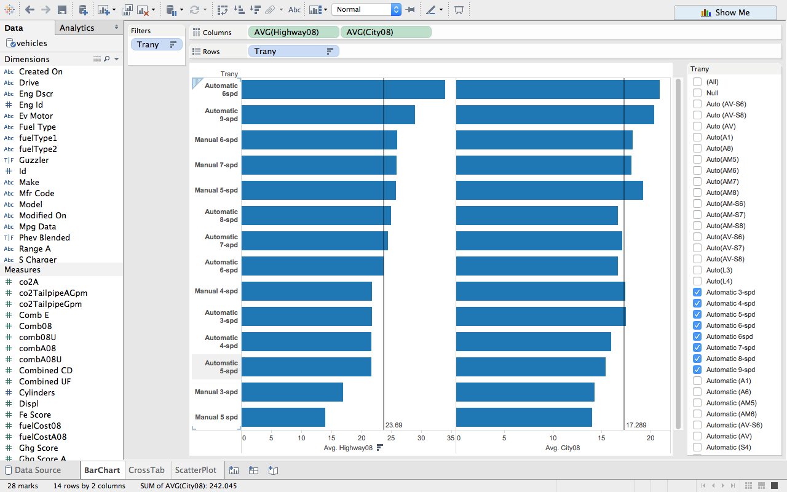
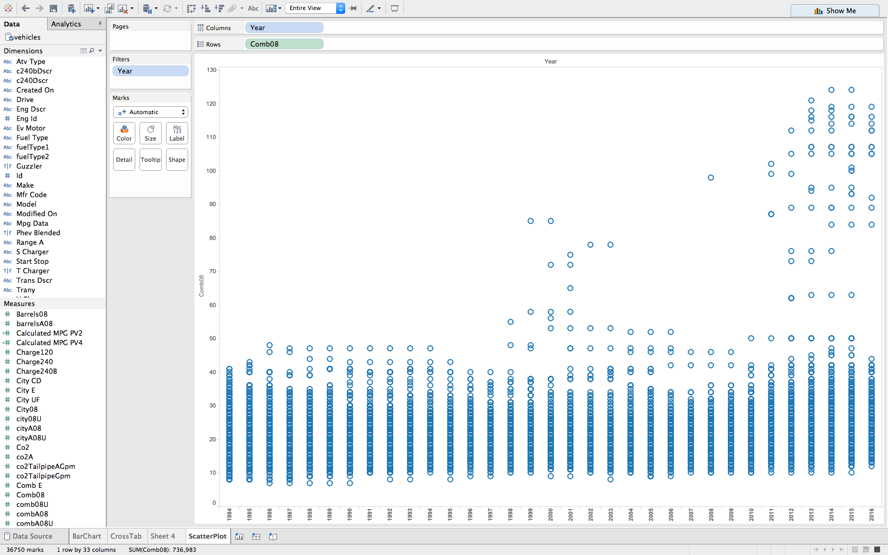
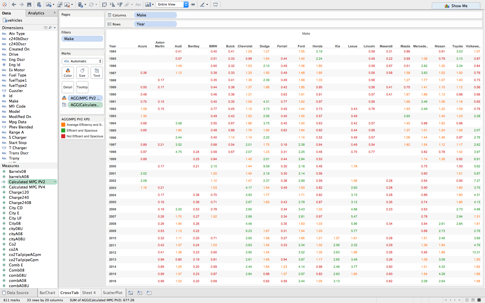
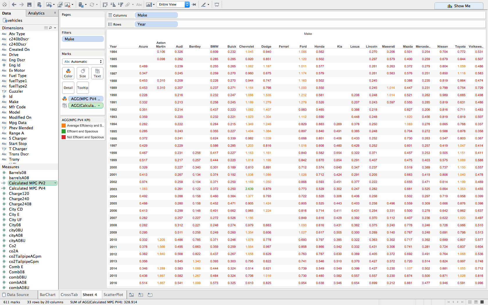

# Exploring U.S MPG data to create interesting visual representations for analysis
For this project, we looked at the Environmental Protection Agency's [fuel economy data](https://www.fueleconomy.gov/feg/download.shtml) for every vehicle tested at the National Vehicle and Fuel Emissions Laboratory in Ann Arbor, Michigan since 1984. This dataset has data on almost 37,000 different vehicles, and includes many attributes to analyze. 

### A detailed explanation of each column that we used in the vehicles dataset:  

* ATVTYPE - type of alternative fuel or advanced technology vehicle
* BARRELS08 - annual petroleum consumption in barrels for fuelType1
* BARRELSA08 - annual petroleum consumption in barrels for fuelType2
* CITY08 - city MPG for fuelType1
* CITYA08 - city MPG for fuelType2
* CO2TAILPIPEGPM - tailpipe CO2 in grams/mile for fuelType1 
* CO2TAILPIPEAGPM - tailpipe CO2 in grams/mile for fuelType2
* COMB08 - combined MPG for fuelType1
* COMBA08 - combined MPG for fuelType2
* CYLINDERS - engine cylinders 
* FUELCOST08 - annual fuel cost for fuelType1 ($) 
* FUELCOSTA08 - annual fuel cost for fuelType2 ($)
* FUELTYPE - fuel type with fuelType1 and fuelType2 (if applicable)
* FUELTYPE1 - fuel type 1. For single fuel vehicles, this will be the only fuel. For dual fuel vehicles, this will be the conventional fuel
* FUELTYPE2 - fuel type 2. For dual fuel vehicles, this will be the alternative fuel (e.g. E85, Electricity, CNG, LPG). For single fuel vehicles, this field is not used
* HIGHWAY08 - highway MPG for fuelType1 
* HIGHWAYA08 - highway MPG for fuelType2
* HLV - hatchback luggage volume (cubic feet)
* HPV - hatchback passenger volume (cubic feet)
* LV2 - 2 door luggage volume (cubic feet)
* LV4 - 4 door luggage volume (cubic feet)
* MPGDATA - has My MPG data
* PV2 - 2-door passenger volume (cubic feet)
* PV4 - 4-door passenger volume (cubic feet)
* TRANY - transmission
* YEAR - model year

## Plot 1: Bar chart of Average MPG of vehicles based on transmission type
The first plot in Tableau is a bar chart with a reference line that looks at the effect of transmission type on highway and city MPG. Our first impression was that a manual transmission would produce the best MPG, but we were surprised to learn that an automatic 6-speed transmission produces not only the highest city MPG but also the highest highway MPG. Doing some [further research](http://www.edmunds.com/fuel-economy/five-myths-about-stick-shifts.html), we found that manual transmissions used to be more fuel efficent, but because of recent advances in automatic transmission technology, automatic transmissions have started to become more efficient in some cases.

### Plot 1: Tableau bar chart with reference line

## Plot 2: Scatterplot of Combined MPG of all vehicles since 1984
The next tableau plot is a scatterplot that looks at how the combined MPG of all cars since 1984 has evolved over the years. This plot was created to see if a trend was present. Initially, we were fairly confident that a positive trend would be present due to the recent advances in EV technology and general improvements in the efficency of internal combustion engines.

However, what we were surprised to find was how drastic and inconsistent the trend was. From 1984 to about 1998, no car that the EPA tested ever got above a combined MPG rating of 50, resutling in a relatively flat trend. Then from 1998 to 2003, there are numerous vehicles getting above the 50 MPG mark, resulting in a very steep positive trend for those years. From 2003 to just before 2010, all but one vehicle got less than 55 MPG, so there is a very steep decline and then flat trend for that time period. From 2010 onward, a steep positive trend emerges again as the number of vehicles above the 55 MPG mark explodes.  

### Plot 2: Tableau scatterplot

## Plot 3: Cross tab of top 20 vehicle manufacturers and the MPG to passenger volume ratio for 2 door cars since 1984
The next plot is a tableau cross tab with a Key Performance Indicator that provides a visual representation of which vehicle manufacturers produced 2 door cars that were efficent (high combined MPG) and spacious (as measured by the passenger volume of the vehicle). Plots 7 and 8 look at 4 door cars since 1984. To calculate the ratio used for the KPI, we summed up the combined MPG of all the 2 door vehicles that a manufacturer produced during a model year and divided that by the total passenger volume for all those 2 door vehicles. The KPI categories are as follows: 

* Efficient and Spacious (KPI value > 2) - a manufacturer acheives this designation by offering a portfolio of 2 door cars that have a high combined MPG rating relative to the total passenger volume
* Average Efficiency and Space (1 <= KPI value < 2) - a manufacturer acheives this designation by offering a portfolio of 2 door cars that have a combined MPG rating relatively equal to the total passenger volume
* Not Efficient and Spacious - (KPI value < 1) a manufacturer acheives this designation by offering a portfolio of 2 door cars that have a low combined MPG relative to the total passenger volume

The interesting takeaway from this graph is that it visually represents a car company's 2 door vehicle portfolio in terms of how efficent those cars are relative to how much passenger volume it has (which, for the purposes of our analysis, is used as a proxy for the size of the vehicle). It also shows that some car companies, like Chevy and Ford, have generally improved the efficency of their vehicles relative to how large the car is. There are also other companies, like Honda, that have newer vehicles achieving much worse efficieny to size ratios than the older models. 

### Plot 3: Tableau cross tab for 2 door cars (PV2 KPI)

## Plot 4: Cross tab of top 20 vehicle manufacturers and the MPG to passenger volume ratio for 4 door cars since 1984
The final tableau plot is a cross tab that provides a visual representation of which vehicle manufacturers produced 4 door cars that were efficent (high combined MPG) and spacious (as measured by the passenger volume of the vehicle). To calculate the ratio used for the KPI, we summed up the combined MPG of all the 4 door vehicles that a manufacturer produced during a model year and divided that by the total passenger volume for all those 4 door vehicles. The KPI categories are as follows: 

* Efficient and Spacious (KPI value > 2) - a manufacturer acheives this designation by offering a portfolio of 4 door cars that have a high combined MPG rating relative to the total passenger volume
* Average Efficiency and Space (1 <= KPI value < 2) - a manufacturer acheives this designation by offering a portfolio of 4 door cars that have a combined MPG rating relatively equal to the total passenger volume
* Not Efficient and Spacious - (KPI value < 1) a manufacturer acheives this designation by offering a portfolio of 4 door cars that have a low combined MPG relative to the total passenger volume

The interesting takeaway from this graph is that it visually represents a car company's 4 door vehicle portfolio in terms of how efficent those cars are relative to how much passenger volume it has (which, for the purposes of our analysis, is used as a proxy for the size of the vehicle).

### Plot 4: Tableau cross tab for 2 door cars (PV4 KPI)

